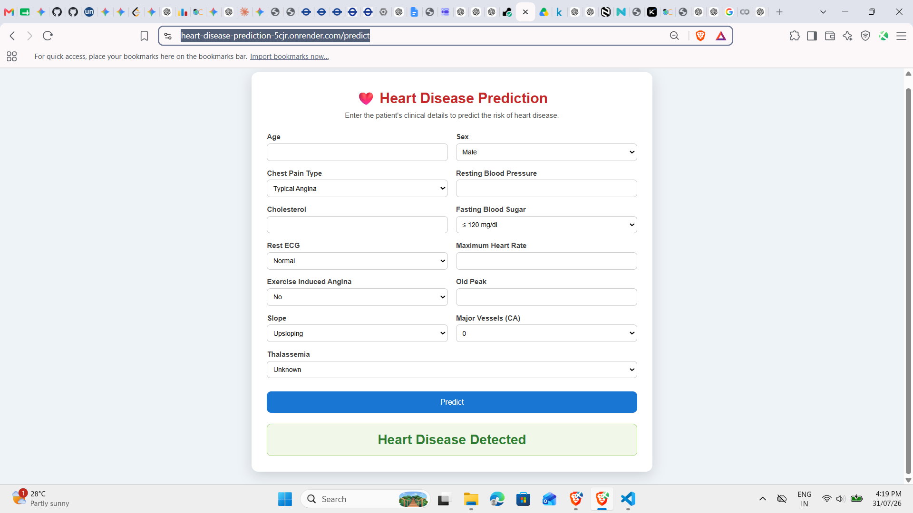

# ❤️ Heart Disease Prediction

A Machine Learning web application that predicts the likelihood of heart disease based on patient clinical parameters. The application is built using **Python**, **Scikit-learn**, and **Flask**, with a **Random Forest Classifier** trained on the Heart Disease dataset. The trained model is deployed as a web application on **Render**, allowing users to make predictions through an intuitive interface.

---

## 🚀 Live Demo

**Deployed Application:**
https://heart-disease-prediction-5cjr.onrender.com

---

## 📌 Project Overview

Heart disease is one of the leading causes of death worldwide. Early prediction can assist healthcare professionals in identifying high-risk patients and making informed clinical decisions.

This project develops a machine learning model capable of predicting the presence of heart disease using patient health indicators such as age, cholesterol level, blood pressure, chest pain type, maximum heart rate, and other clinical attributes.

The trained model is integrated into a Flask web application, enabling users to enter patient information through a user-friendly interface and instantly receive a prediction.

---

## 🎯 Objectives

- Perform data preprocessing and exploration
- Train a Machine Learning classification model
- Evaluate model performance
- Serialize the trained model using Joblib
- Build a Flask-based web application
- Deploy the application using Render

---

## 📂 Dataset

**Dataset:** Heart Disease Prediction Dataset

The dataset contains patient clinical information including:

- Age
- Sex
- Chest Pain Type
- Resting Blood Pressure
- Cholesterol
- Fasting Blood Sugar
- Resting ECG
- Maximum Heart Rate
- Exercise Induced Angina
- Old Peak
- Slope
- Number of Major Vessels (CA)
- Thalassemia

**Target Variable**

- 0 → No Heart Disease
- 1 → Heart Disease

---

## 🛠 Technologies Used

- Python
- Pandas
- NumPy
- Scikit-learn
- Flask
- Joblib
- HTML5
- CSS3
- Gunicorn
- Render

---

## 🤖 Machine Learning Model

Algorithm used:

- Random Forest Classifier

Training configuration:

- Train-Test Split: 80:20
- Random State: 42
- Number of Trees: 100

---

## 📊 Model Performance

**Test Accuracy**

```
98.54%
```

The trained Random Forest classifier achieved excellent performance on the testing dataset and was serialized using Joblib for deployment.

---

## 🌐 Web Application Features

- Responsive user interface
- Human-friendly input form
- Dropdown menus for categorical features
- Instant heart disease prediction
- Flask backend
- Deployed on Render

---

## 📁 Project Structure

```
heart-disease-prediction/
│
├── app.py
├── train_model.py
├── Procfile
├── requirements.txt
├── README.md
├── .gitignore
│
├── notebook/
│   └── heart-disease-prediction.ipynb
│
├── model/
│   └── heart_model.pkl
│
├── data/
│
├── images/
│
├── templates/
│   └── index.html
│
└── static/
    └── style.css
```

---

## ⚙️ Installation

Clone the repository

```bash
git clone https://github.com/Avinash0717/heart-disease-prediction.git
```

Navigate into the project

```bash
cd heart-disease-prediction
```

Create a virtual environment

```bash
python -m venv .venv
```

Activate the virtual environment

### Windows

```bash
.venv\Scripts\activate
```

### Linux / macOS

```bash
source .venv/bin/activate
```

Install dependencies

```bash
pip install -r requirements.txt
```

---

## ▶️ Run the Application

Start the Flask server

```bash
python app.py
```

Open your browser

```
http://127.0.0.1:5000
```

---

## 📸 Application Preview

```Markdown

```

---


## 📝 Conclusion

This project demonstrates a complete machine learning workflow, from data preprocessing and model training to deployment as a production-ready web application. A Random Forest classifier was trained to predict heart disease using clinical attributes and achieved an accuracy of **98.54%** on the test dataset. The trained model was serialized with Joblib and integrated into a Flask application featuring a user-friendly interface. Finally, the application was successfully deployed on Render, making it accessible through the web.

---

## 👨‍💻 Author

**Avinash Rajput**

23BCE10978

IN26012627

B.Tech Computer Science Engineering

VIT Bhopal University
